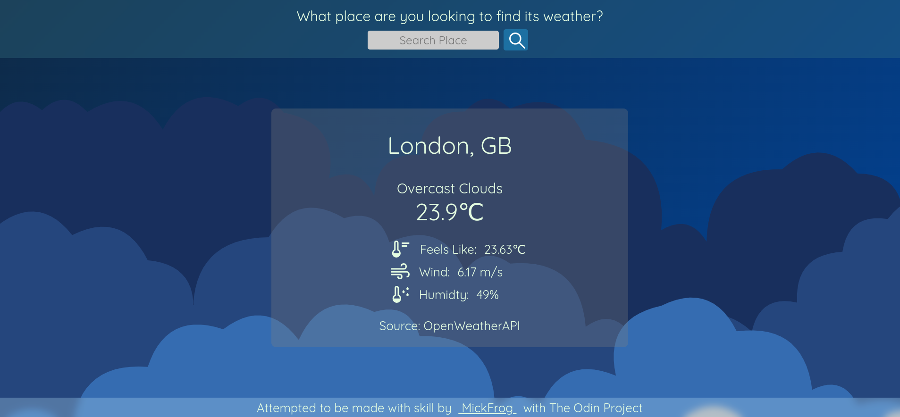
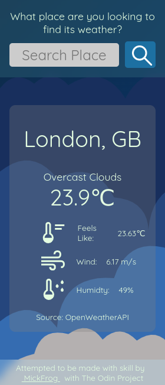

# weatherApp

This is weather App project made as part of [The Odin Project](https://www.theodinproject.com)

## Features

1. Uses webpack to bundle different files into one.
2. Makes API call to OpenWeatherAPI for weather data.
3. This was used to test my skills of API calls and fetching data together
   with the use of async and await.
4. Backgrounds are changed according to current city main weather description.

## Demo

The live project can be viewed live [here](https://mickfrog.github.io/weatherApp/)

## Preview

### Desktop Preview

### Mobile Preview

## Built With

-   HTML
-   CSS
-   JavaScript
-   Webpack

[MickFrog](https://www.github.com/MickFrog)
